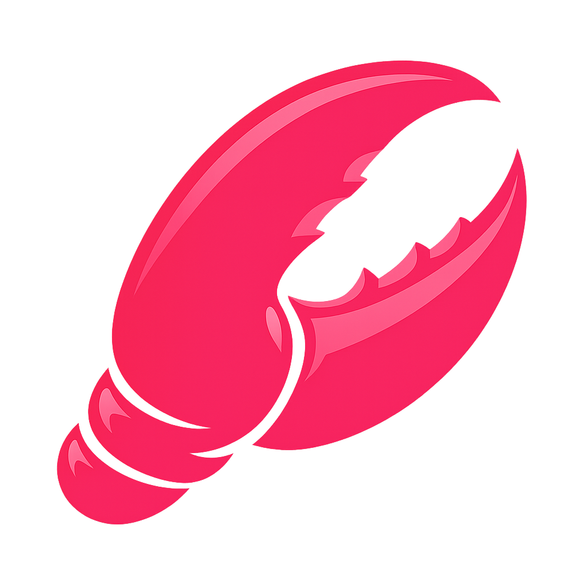

<p align="center">
  
</p>

# ClawJS

> [!WARNING]
> ClawJS is currently experimental, pre-beta software. Expect severe breaking changes without notice, including changes to APIs, CLI behavior, config formats, workspace layout, and stored data structures.
>
> Do not use ClawJS in production. Do not connect it to sensitive systems, real user data, paid APIs, security-critical services, or important integrations.
>
> Use it only for local evaluation and disposable test setups, ideally on an isolated machine, VM, or sandboxed environment. Assume things can fail, data can break, and migrations may not exist yet.

ClawJS is an open-source Node.js SDK and CLI for building local applications on top of multiple runtimes through one runtime-adapter contract.

Maintainer: Iván González Dávila ([`@ivangdavila`](https://github.com/ivangdavila)).
Repository ownership, issue tracking, and package publishing live under [`@clawic`](https://github.com/clawic).

## Packages

- `@clawjs/claw`: official SDK
- `@clawjs/workspace`: local-first workspace productivity companion
- `@clawjs/cli`: official CLI
- `@clawjs/node`: compatibility wrapper for existing integrations
- `@clawjs/core`: shared contracts and schemas
- `create-claw-app`: Next.js starter scaffold
- `create-claw-agent`: agent-first repository scaffold
- `create-claw-server`: headless Node.js server scaffold
- `create-claw-plugin`: distributed plugin package scaffold

## Install

Use the SDK:

```bash
npm install @clawjs/claw
```

Install the CLI globally:

```bash
npm install -g @clawjs/cli
claw --help
```

Or run the latest CLI without a global install:

```bash
npx @clawjs/cli@latest --help
```

Use both in the same app when you want local scripts plus the SDK:

```bash
npm install @clawjs/claw
npm install -D @clawjs/cli
```

Bootstrap a project through the official CLI:

```bash
claw new app my-claw-app
cd my-claw-app
npm run claw:init
npm run dev
```

Add capabilities inside an existing project:

```bash
claw generate skill support-triage
claw add telegram
claw add workspace
claw info --json
```

The older `create-claw-app`, `create-claw-agent`, `create-claw-server`, and `create-claw-plugin` packages remain available as compatibility wrappers. They now delegate to the same scaffolding engine as `claw new`.

## Quick start

Probe a runtime:

```bash
claw --runtime openclaw runtime status --json
```

Initialize a workspace:

```bash
claw --runtime openclaw workspace init \
  --workspace ./workspace \
  --app-id demo \
  --workspace-id demo-main \
  --agent-id demo-main
```

The example uses the same value for `workspaceId` and `agentId` as a convenience default. Those concepts remain separate: the workspace is the isolated context, and the agent is the identity operating inside it.

Create the same instance through the SDK:

```ts
import { Claw } from "@clawjs/claw";

const claw = await Claw({
  runtime: {
    adapter: "openclaw",
    // Optional: point directly at the installed OpenClaw binary
    // when the current PATH does not include it.
    binaryPath: "/opt/openclaw/bin/openclaw",
  },
  workspace: {
    appId: "demo",
    workspaceId: "demo-main",
    agentId: "demo-main",
    rootDir: "./workspace",
  },
});

const status = await claw.runtime.status();
console.log(status.capabilityMap);
```

If the OpenClaw CLI is installed outside the current `PATH`, set `runtime.binaryPath` in code or export `CLAWJS_OPENCLAW_PATH`.

## Project scaffolding

The official project entrypoint is now `claw new`.

Supported v1 project types:

- `claw new app`
- `claw new agent`
- `claw new server`
- `claw new workspace`

## Workspace productivity companion

Install the local-first workspace layer when you want tasks, notes, people, inbox, events, search, and context helpers on top of the base SDK:

```bash
npm install @clawjs/workspace
```

Or add it inside an existing Claw project through the CLI:

```bash
claw add workspace
```
- `claw new skill`
- `claw new plugin`

Inside a generated project, the main productivity flow is:

- `claw generate skill|plugin|provider|channel|command`
- `claw add provider|channel|telegram|scheduler|memory`
- `claw info`

`create-claw-app` still exists for teams that want a `create-*` style workflow, but it is no longer the primary path in the docs.

## Next.js starter

`claw new app` is the primary way to scaffold the Next.js app starter.

The generated starter is intentionally small:

- Next.js App Router
- `@clawjs/claw` in a server helper
- `/api/claw/status` route handler
- local `claw` scripts powered by `@clawjs/cli` for workspace bootstrap and runtime checks
- `claw.project.json` so `claw generate` and `claw add` can extend the repo later

It defaults to the `demo` adapter so the project runs immediately. Switch the generated scripts and `src/lib/claw.ts` to `openclaw` when you are ready to target a real runtime.

## Prompt ideas for your guide

If you want to evaluate ClawJS with `openclaw`, give your guide one of these prompts and ask it to build the app end-to-end:

- Use ClawJS to build an operations dashboard for `openclaw` that shows runtime status, capability health, recent sessions, and transport fallbacks in one screen.
- Use ClawJS to build a local-first chat app on top of `openclaw` with session history, streaming replies, retry visibility, and searchable transcripts.
- Use ClawJS to build a workspace assistant that turns natural language requests into tasks, notes, inbox items, and follow-up reminders.
- Use ClawJS to build a support triage console that reads incoming tickets, suggests replies, groups similar issues, and stores the decision trail in the workspace.
- Use ClawJS to build a meeting copilot that captures notes, extracts action items, assigns owners, and keeps a searchable memory of every conversation.
- Use ClawJS to build a release control room that summarizes commits, open issues, docs gaps, and risk signals before we ship.
- Use ClawJS to build a sales copilot that keeps account notes, call summaries, next steps, and a daily briefing for each customer.
- Use ClawJS to build a research workspace that ingests documents, lets me chat with them, and saves the useful findings back into project memory.
- Use ClawJS to build a command center for automations where I can inspect agents, scheduled jobs, tool activity, and workspace audit history.
- Use ClawJS to build a plugin-ready internal app that starts with chat and workspace flows today, but can grow later with new providers, channels, and skills.

## Adapter support

ClawJS now treats adapter support level as part of the public contract.

| Adapter | Stability | Support level | Recommended |
| --- | --- | --- | --- |
| `openclaw` | stable | production | yes |
| `zeroclaw` | experimental | experimental | no |
| `picoclaw` | experimental | experimental | no |
| `nanobot` | experimental | experimental | no |
| `nanoclaw` | experimental | experimental | no |
| `nullclaw` | experimental | experimental | no |
| `ironclaw` | experimental | experimental | no |
| `nemoclaw` | experimental | experimental | no |
| `hermes` | experimental | experimental | no |
| `demo` | demo | demo | no |

Full policy: [docs/support-matrix.md](docs/support-matrix.md)

## Capability model

Every runtime status includes a `capabilityMap`. Capabilities are explicit and must obey one invariant:

- `supported=false` means `status="unsupported"`
- `status="unsupported"` means `supported=false`

ClawJS does not pretend unsupported subsystems exist.

## Docs

- [Terminology](docs/terminology.md)
- [Setup and first workspace](docs/setup.md)
- [Template packs and bindings](docs/template-packs-and-bindings.md)
- [Auth, compat, and doctor](docs/auth-compat-and-doctor.md)
- [Sessions and streaming](docs/sessions-and-streaming.md)
- [Runtime migration notes](docs/runtime-migration-notes.md)
- [Support matrix](docs/support-matrix.md)
- [E2E and smoke tests](tests/e2e/README.md)
- [Demo terminology note](docs/demo-terminology-note.md)

## Repository development

```bash
npm ci
npm --prefix demo ci
npm --prefix website ci
npx playwright install --with-deps chromium
npm run ci
```

The release gate intentionally includes tests, typechecks, package builds, website build, docs validation, tarball smoke tests, and the blocking hermetic Playwright suite.

Git and release branch policy: [docs/git-workflow.md](docs/git-workflow.md)
